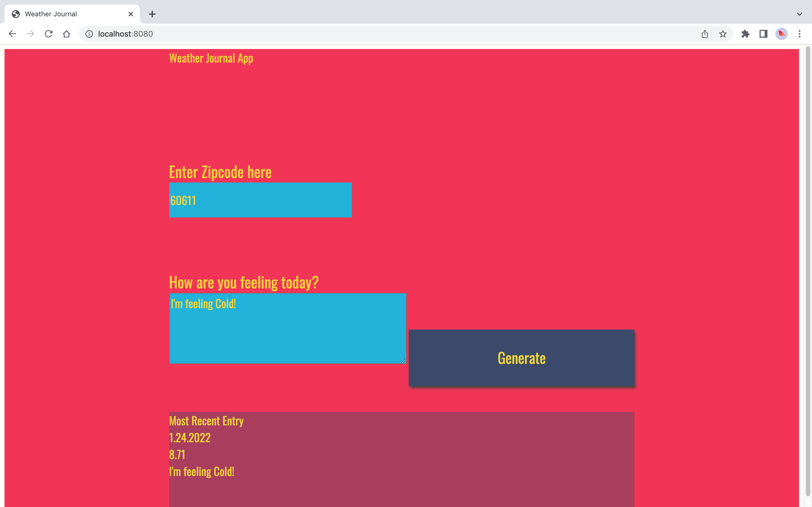
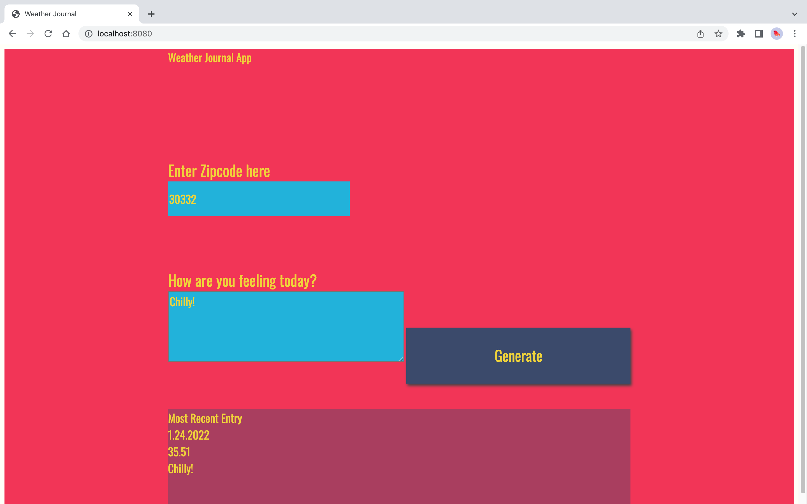
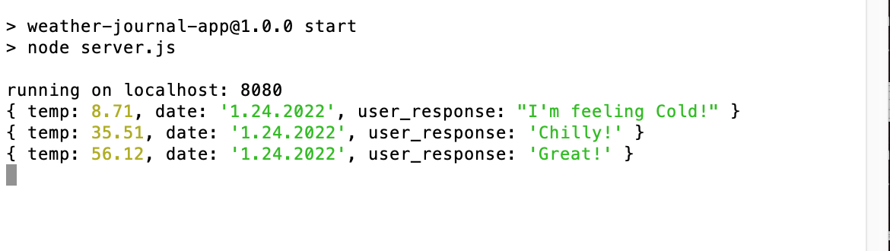

# Weather Journal App Project

## Overview
This project creates an asynchronous web app that uses Web API from OpenWeatherAPI and user data to dynamically update the UI.

## Description
A server was created in `server.js` and web client was created in `website/app.js`. `index.html` was used to bind interactivity of Javascript and update UI elements dynamically.

The `server.js` sets up Node.js, handles GET and POST routes, and stores app data.

The `website/app.js` fetches OpenWeatherMap API data and stores the weather data of the user entered zip code onto the Server.

GET and POST use asynchronous JavaScript syntax so that operations don't break the WebApp UI during GET and POST operations.

The UI elements are dynamically updated in `index.html` with fetched API data and displayed on the browser running `localhost:8080`.

## Instructions

1. Run the `server.js` file in the terminal or command line window. Before running make sure your machine has Node.js, express, cors, and body-parser packages installed.

1. Open a web browser and go to: `localhost:8080`. Fill in a US zip code, how you are feeling in the text prompt and hit the Generate button.

1. In the most recent entry prompt you should see updated UI elements showing today's date, the temperature in Fahrenheit and the how you're feeling prompt.

# Screenshots

